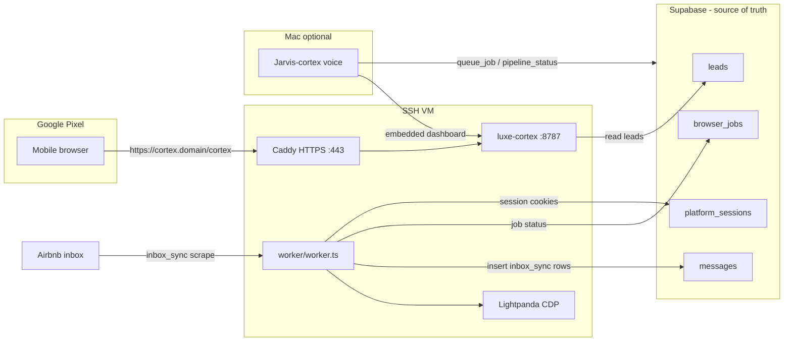

# JARVIS CRM Pipeline Audit & VM + Pixel Setup

## Current architecture (what you're connecting)




**Important clarifications:**

- There is no standalone "JARVIS CRM" product — CRM behavior is **Supabase** (`leads`, `messages`, `browser_jobs`) plus **luxe-cortex** (dashboard) and **Jarvis-cortex** (voice agent).
- Real leads (5k+) live in **Supabase `leads`**. luxe-cortex D1 is UI/demo state (messages, events) — not the Airbnb inbox source of truth.
- Airbnb inbox data lands in **Supabase `messages`** with `category = 'inbox_sync'` via `[worker/src/worker.ts](worker/src/worker.ts)` (`jobInboxSync`).

---

## Phase 1 — Pull Supabase data for analysis

Create a read-only audit script at `[scripts/pipeline_audit.py](scripts/pipeline_audit.py)` that uses the same credentials pattern as `[Jarvis-cortex/actions/luxe_supabase.py](Jarvis-cortex/actions/luxe_supabase.py)` (`SUPABASE_URL` + `SUPABASE_SERVICE_KEY` from env or `config/api_keys.json`).

**Queries to run:**


| Dataset                                      | Purpose                                                                           |
| -------------------------------------------- | --------------------------------------------------------------------------------- |
| `browser_jobs` where `kind = 'inbox_sync'`   | Job success/fail rate, `result.threads_found` vs `result.synced`                  |
| `messages` where `category = 'inbox_sync'`   | Recorded thread bodies + `meta` JSON (`thread_id`, `message_count`, `scraped_at`) |
| `browser_jobs` where `kind = 'send_message'` | Outbound attempts; check `result.dry_run`, `result.verified`                      |
| `platform_sessions`                          | Session health (`status`, `error_count`, `last_used_at`)                          |
| `leads` where `source_platform = 'airbnb'`   | Lead records created from scrape/search                                           |


**Output:** JSON snapshot written to a known path (e.g. `scripts/audit-output.json`) that the canvas will embed. This avoids `fetch()` in the canvas (forbidden by canvas rules).

**Known integrity checks to compute:**

1. **Job vs message gap** — For each `inbox_sync` job marked `done`, compare `result.synced` to actual `messages` rows whose `meta.scraped_at` falls within the job window.
2. **Thread coverage** — Unique `meta.thread_id` values in `messages` vs sum of `result.threads_found` across jobs.
3. **Duplicate risk** — `jobInboxSync` uses `INSERT` only (no upsert on `thread_id`), so re-runs may create duplicate rows. Flag threads with >1 `inbox_sync` message.
4. **Lead linkage** — `lead_id` defaults to Airbnb `thread_id` when no `payload.lead_id`; flag rows where `lead_id` does not match a real `leads.id`.
5. **Outbound verification** — For `send_message` jobs, confirm `result.verified === true` (composer-empty + bubble-match check in worker).

---

## Phase 2 — Canvas: pipeline integrity dashboard

Create `[/Users/devinci/.cursor/projects/Users-devinci-luxe-mstr-rebuild/canvases/jarvis-pipeline-audit.canvas.tsx](/Users/devinci/.cursor/projects/Users-devinci-luxe-mstr-rebuild/canvases/jarvis-pipeline-audit.canvas.tsx)` embedding the audit JSON inline.

**Sections (only render sections with real data):**

- **Summary stats** — total inbox_sync jobs, success rate, total messages recorded, worker session status
- **Bar chart** — `browser_jobs` by `status` (pending / done / failed) for `inbox_sync`
- **Line chart** — `inbox_sync` messages recorded per day (`meta.scraped_at`)
- **Table** — failed jobs with `error` column; threads with duplicate sync rows
- **Callout** — actionable gaps (e.g. "12 threads synced twice", "3 jobs synced 0 of N threads")

All charts labeled with title, axis units, legend, and caption: `Source: Supabase · exported <date>`.

---

## Phase 3 — Deploy full stack on SSH VM

Follow and extend `[luxe-cortex/docs/deploy-self-hosted-vm.md](luxe-cortex/docs/deploy-self-hosted-vm.md)`.

**Services to run on VM (all via systemd):**


| Service     | Path                                                                     | Port |
| ----------- | ------------------------------------------------------------------------ | ---- |
| Lightpanda  | `lightpanda serve --host 127.0.0.1 --port 9222`                          | 9222 |
| Worker      | `[worker/](worker/)` `npm start`                                         | —    |
| luxe-cortex | `[luxe-cortex/](luxe-cortex/)` `wrangler dev --ip 127.0.0.1 --port 8787` | 8787 |
| Caddy       | reverse proxy                                                            | 443  |


**New file:** `luxe-cortex/docs/vm-systemd-units.md` (or add to deploy doc) with unit files for:

- `luxe-worker.service` (depends on Lightpanda)
- `luxe-lightpanda.service`
- Existing `luxe-cortex.service`

**Env on VM** (`[worker/.env.example](worker/.env.example)`):

- `SUPABASE_URL`, `SUPABASE_SERVICE_KEY`
- `LIGHTPANDA_WS=ws://127.0.0.1:9222`

**Cookie bootstrap** (keep Mac login, push to VM worker): `[scripts/airbnb_cookie_push.py](scripts/airbnb_cookie_push.py)` — run from Mac when session expires.

**Smoke test after deploy:**

```bash
# Queue inbox sync via Jarvis tool or SQL
insert into browser_jobs (id, kind, status, priority, payload)
values ('bj_test', 'inbox_sync', 'pending', 10, '{"limit": 5}');
# Confirm: job -> done, new rows in messages with category inbox_sync
```

---

## Phase 4 — Google Pixel: mobile browser to Cortex

Your choice: **mobile browser → VM-hosted luxe-cortex**.

1. Point DNS `cortex.yourdomain.com` → VM IP
2. Caddy auto-HTTPS (step 5 of deploy doc)
3. On Pixel: open `https://cortex.yourdomain.com/cortex`
4. Bookmark to home screen for PWA-like access

**Cortex mobile UX** — `[luxe-cortex/src/routes/cortex.tsx](luxe-cortex/src/routes/cortex.tsx)` is WebGL-heavy; verify layout on Pixel (may need minor responsive tweaks in `[luxe-cortex/src/components/](luxe-cortex/src/components/)` if panels overflow).

**Voice on phone:** Jarvis-cortex (PyQt6) stays on Mac/VM — not on Android. Pixel gets the **visual dashboard** only. Voice control remains on desktop via `JARVIS_MINDMAP_URL=https://cortex.yourdomain.com/cortex`.

---

## Phase 5 — Jarvis agent as CRM controller

Jarvis already controls the real pipeline via `[Jarvis-cortex/actions/luxe_supabase.py](Jarvis-cortex/actions/luxe_supabase.py)`:

- `pipeline_status` — lead counts + pending jobs
- `worker_health` — session status
- `queue_job` — safe kinds: `session_refresh`, `inbox_sync`, `scrape_listing`
- `job_status` — recent job breakdown

**Wire-up checklist:**

1. Set `luxe_supabase_url` + `luxe_supabase_service_key` in `[Jarvis-cortex/config/api_keys.json](Jarvis-cortex/config/api_keys.json)`
2. Set `JARVIS_MINDMAP_URL` to VM cortex URL
3. Voice commands: *"Jarvis, queue an inbox sync"* → `queue_job(kind=inbox_sync)`
4. Voice commands: *"What's the worker health?"* → `worker_health`

**Optional hardening (small code changes, post-audit):**

- Add `inbox_sync` idempotency: upsert on `meta.thread_id` + `scraped_at` window instead of blind INSERT in `[worker/src/worker.ts](worker/src/worker.ts)`
- Add Supabase `agent_audit` table for Jarvis-queued actions (currently only D1 `events` logs demo-path actions)

---

## Execution order

1. Run `pipeline_audit.py` against live Supabase (needs service key)
2. Build canvas from audit output
3. Deploy VM services + verify one `inbox_sync` end-to-end
4. Open cortex URL on Pixel and confirm live lead/inbox data visible
5. Point Jarvis-cortex on Mac at VM URL; test voice `queue_job` + `worker_health`

## Risks / gaps to watch

- **D1 vs Supabase drift** — Stage moves via `/api/jarvis` write to D1, not Supabase `leads.status`
- **Duplicate inbox rows** — Re-sync without dedup inflates message counts
- **Session expiry** — Worker fails silently on expired Airbnb cookies; auto-queues `session_refresh` but needs manual login
- **No worker systemd unit in repo yet** — must be created during VM deploy

